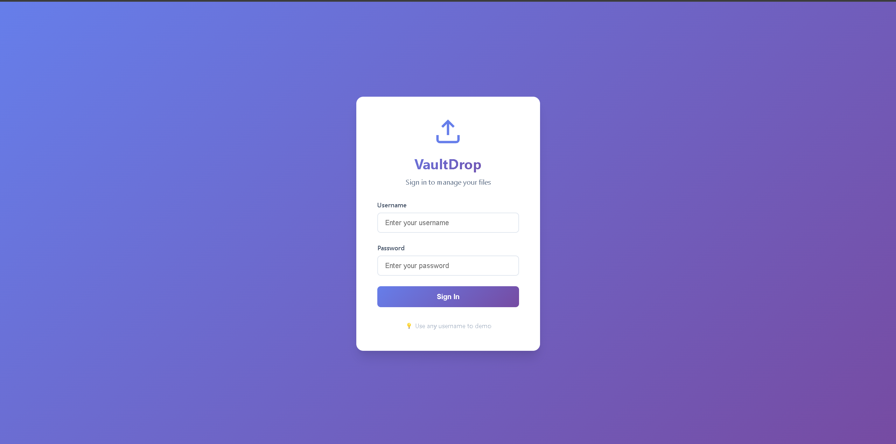
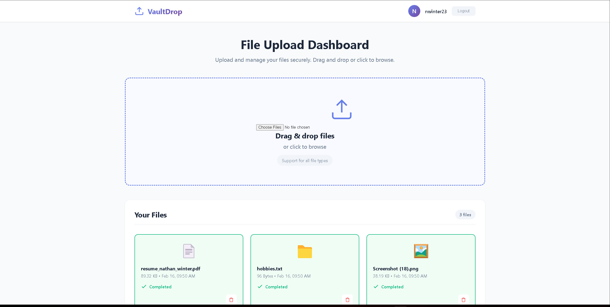

# File Upload Dashboard

A lightweight React + TypeScript + Vite application for managing file uploads.  
This dashboard allows users to log in with any username and password (demo credentials) and upload files with progress tracking and visual feedback.

---

## Features

- **Demo Login:** Enter any username and password to access the dashboard.  
- **File Upload:** Drag-and-drop or select files for upload.  
- **Progress Tracking:** Each file shows an individual upload progress bar.  
- **File Management:** Uploaded files are displayed in a card layout.  
- **Toast Notifications:** Alerts for upload success, errors, or warnings.  
- **Responsive Design:** Fully functional on desktop and mobile devices.  

---

## Screenshots & Demo

Login Page:  


Dashboard:  


> **Tip:** Replace the placeholders above with your actual screenshots or GIFs saved in `public/screenshots/`.

---

## Tech Stack

- **Frontend:** React + TypeScript + Vite  
- **Styling:** CSS  
- **Components:** Navbar, FileCard, UploadZone, ProgressBar, Toast  
- **Demo Authentication:** Simple mock login system  

---

## Installation

1. Clone the repository:

```bash
git clone https://github.com/winter0996/file-upload-dashboard.git
cd file-upload-dashboard

2. Install dependencies:
```bash
npm install


3. Start the development server:
```bash
npm run dev


4. Open the app in your browser: http://localhost:5173